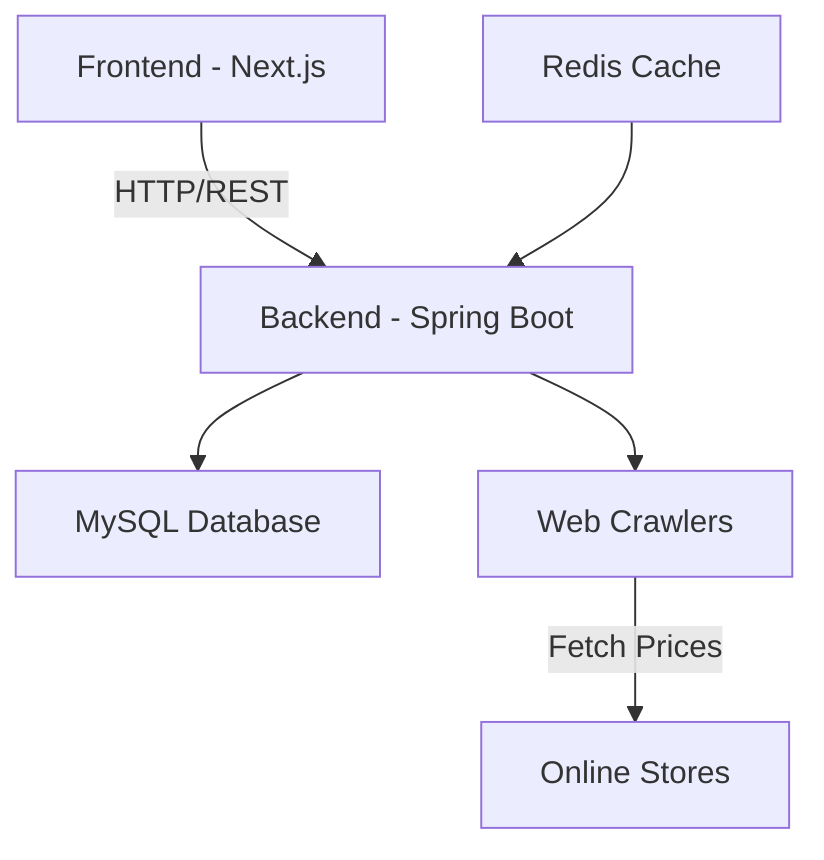

# Food Price Tracker 😋💸

[](https://openjdk.java.net/)
[](https://spring.io/projects/spring-boot)
[](https://nextjs.org/)
[](LICENSE)

A web application that tracks food prices across multiple online stores, featuring real-time data crawling, advanced search capabilities, and data analytics.

## Features

- 🔍 **Smart Search**
  - Real-time price tracking
  - Auto-complete suggestions
  - Spell checking
  - Page ranking by relevance
  - Inverted index for fast results

- 📊 **Analytics**
  - Search pattern tracking
  - Data validation
  - Web crawler monitoring

## Architecture



## Tech Stack

**Backend:**
- Java 21, Spring Boot 3.3
- MySQL, Redis
- Selenium WebDriver

**Frontend:**
- Next.js 14, TypeScript
- Ant Design with Tailwind

## Quick Start

### Backend
```bash
cd backend
./mvnw clean install
./mvnw spring-boot:run
```

### Frontend
```bash
cd frontend
npm install

## API Routes

- `GET /api/products` - Search products
- `GET /api/auto-complete` - Get suggestions
- `GET /api/spell-checking` - Check spelling
- `GET /api/page-ranking` - Get ranked results
- `GET /api/web-crawler` - Crawler status
- `GET /api/data-validation` - Validate data

## Contributing

1. Fork the repo
2. Create feature branch (`git checkout -b feature/new-feature`)
3. Commit changes (`git commit -am 'Add new feature'`)
4. Push branch (`git push origin feature/new-feature`)
5. Create pull request
